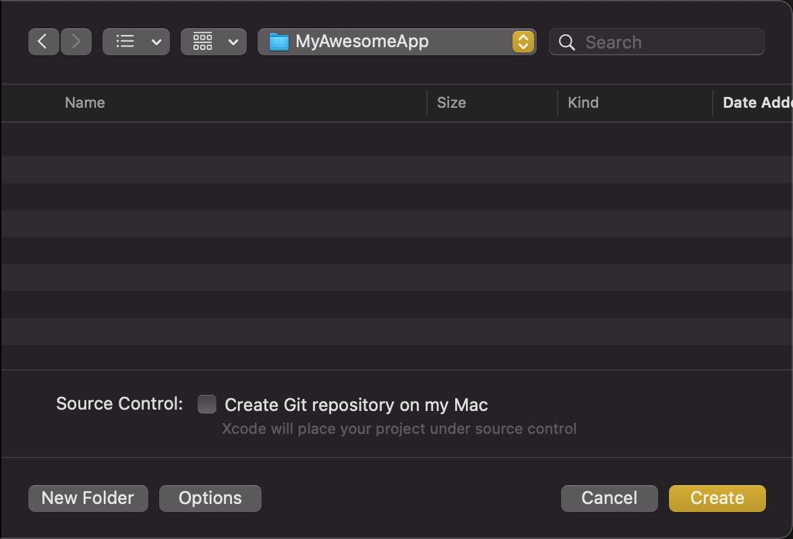
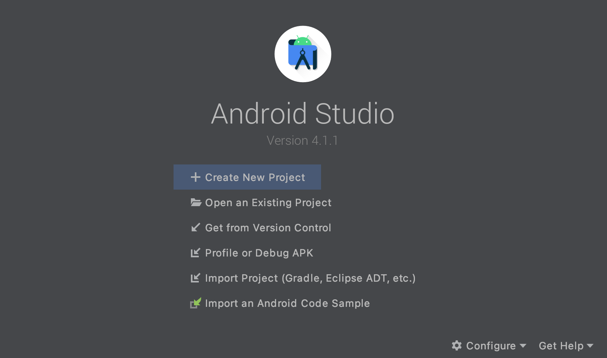
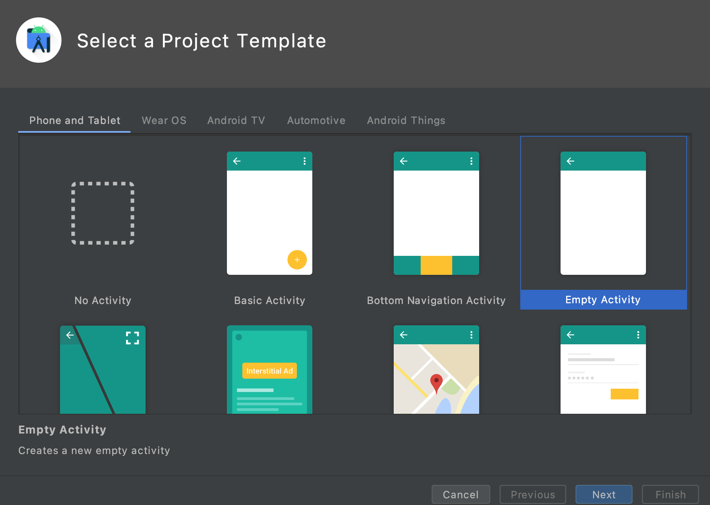
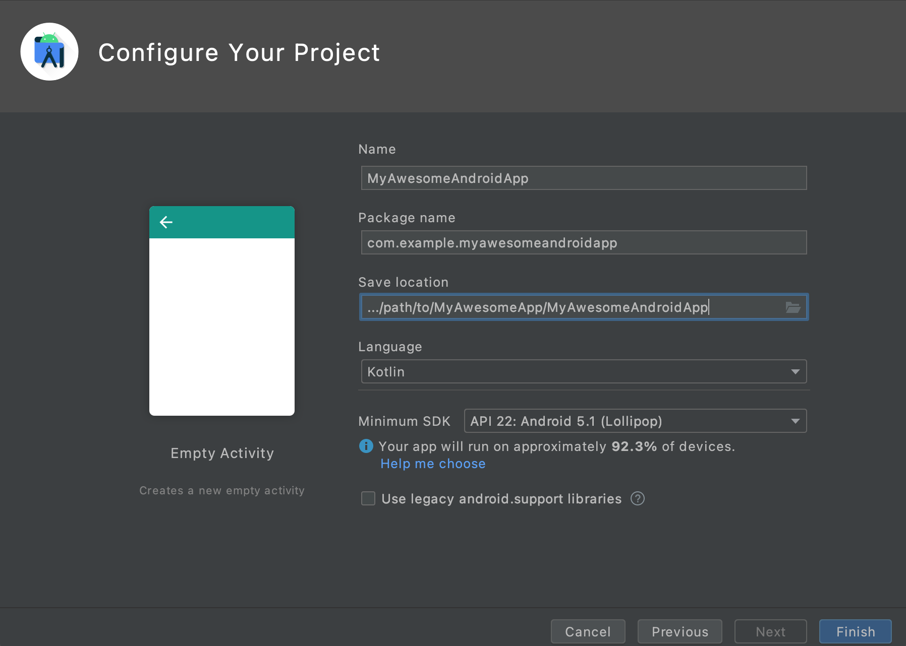
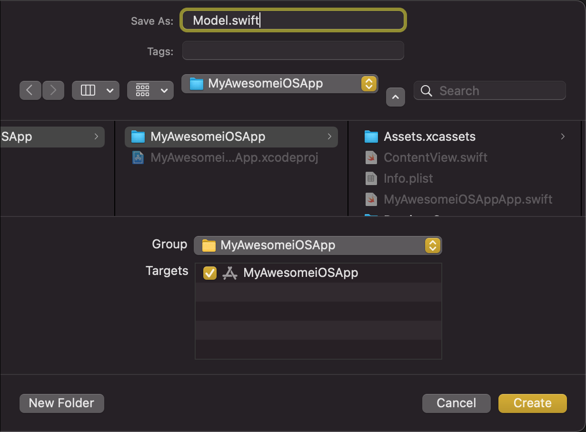

# Translating a new iOS app to Android

*Note:* This section describes Gryphon's integration with Xcode, which is not available on Linux and Docker. To translate an iOS app's logic code without Xcode, make sure it can be compiled without the iOS SDK, then translate it using the [command line interface](translatingCommandLinePrograms.html).

To translate an existing iOS app, check out [Adding Gryphon to an existing app](addingGryphonToAnExistingApp.html).

## Step 1: Create the Xcode project

Create a folder called `MyAwesomeApp`. This is the folder where we'll put our new iOS and Android apps.

Create the iOS project by opening Xcode and going to `File > New > Project` in the menu (or pressing "**⌘ + ⇧ + N**"). Choose `iOS > App` and click `Next`.


Call it `MyAwesomeiOSApp` in the `Product Name` field and make sure the `Language` is set to `Swift`. Then click `Next`.


Navigate to the `MyAwesomeApp` folder you created at the beginning of this step and click `Create`.



#### Step 2: Create the Android project

Let's do the same for Android now. Open Android Studio and click `Create New Project`.



Choose `Phone and Tablet` and `Empty Activity`, then click `Next`.



Name it `MyAwesomeAndroidApp`, set the Package Name to `com.example.myawesomeandroidapp`, and choose `Kotlin` as the language. Set the `Save Location` as a new `MyAwesomeAndroidApp` folder inside your existing `MyAwesomeApp` folder, then click `Finish`.



#### Step 3: Initialize Gryphon

On the terminal, navigate to the `MyAwesomeiOSApp` folder and initialize Gryphon:

```` bash
$ cd MyAwesomeiOSApp
$ gryphon init MyAwesomeiOSApp.xcodeproj/
````

This command tells Gryphon to set up to translate Swift files in the iOS app. It also configures the integration with the Xcode project, which we'll use in the next steps.

#### Step 4: Add a file to translate

If you open the Xcode project, you'll see we already have a few Swift files. These files contain iOS-only code. Let's add a new file to share with Android.

Go to `File > New > File` (or press "**⌘ + N**"). Choose `iOS > Swift File` and click `Next`.


Name the file `Model.swift`. Make sure to create it in the `MyAwesomeApp/MyAwesomeiOSApp/MyAwesomeiOSApp` folder, which contains the other Swift files.



Replace its contents with the following code:

```` swift
// gryphon insert: package com.example.myawesomeandroidapp

import Foundation

struct Card {
    let rank: Int
    let suit: Suit
}

enum Suit: String {
    case hearts = "♥️"
    case diamonds = "♦️"
    case spades = "♠️"
    case clubs = "♣️"
}

````

Notice the `// gryphon insert` comment at the top. It adds the `"package com.example.myawesomeandroidapp"` line to the translated Kotlin file, which tells Android to include the file when building the app. This type of comment that lets us manually change the output code is called a *translation comment*; you can learn more about it [here](translationComments.html).

Next, we have to include the new `Model.swift` file in the list of files that we'll share with Android. Gryphon looks for this list in a file called `gryphonInputFiles.xcfilelist` that was created in the `MyAwesomeiOSApp` folder. This list should contain all of the files to be translated, one in each line. For now, it's empty. Let's add the path to our Model file:

````
MyAwesomeiOSApp/Model.swift

````

Now open Xcode again. There should be a target called `Gryphon`. Switch to that target and hit build (**⌘ + B**).


Gryphon translates the code successfully, but it raises a warning - we didn't tell it where to put the translated code. Do that by adding the following comment to `Model.swift`:

```` swift
// gryphon output: ../MyAwesomeAndroidApp/app/src/main/java/com/example/myawesomeandroidapp/Model.kt
````

Now, hit build again (**⌘ + B**) to translate the code. The new `Model.kt` file should show up in Android Studio, and both apps should compile the new code successfully.

---

*Next: [Building the Android app using Xcode](buildingTheAndroidAppUsingXcode.html)*
